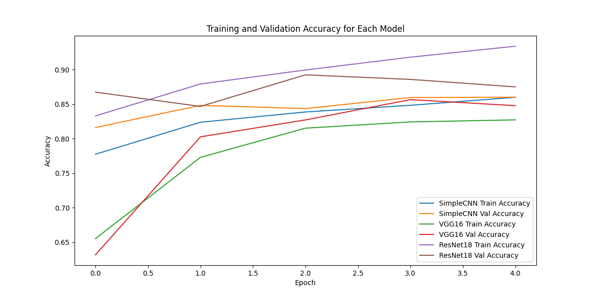
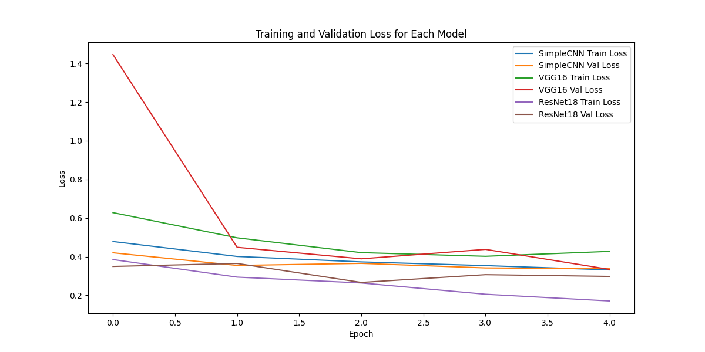

# cnn-cancer-detection

# Histopathologic Cancer Detection: Project Report

## 1. Introduction

This project focuses on the Histopathologic Cancer Detection challenge on Kaggle, which involves identifying metastatic cancer in small image patches taken from larger pathology scans. The dataset consists of labeled histopathology images, each of size 96x96 pixels, and the goal is to predict whether a given image contains cancerous tissue or not.

### Problem Statement

The goal of this competition is to develop a machine learning model that can classify whether a small image patch contains metastatic tissue. This binary classification problem requires a model that can extract useful features from the image data and make accurate predictions.

## 2. Dataset Overview

- Training data: Contains 220,025 labeled images.
- Test data: A set of unlabeled images, for which predictions will be made.
- Image dimensions: 96x96 pixels, with 3 channels (RGB).
- Labels: Binary labels (0 for no cancer, 1 for cancer).
- Data split: An 80/20 train-validation split was used in this project.

## 3. Data Cleaning and Preprocessing

Data Cleaning
- Missing Data: No missing data, as each image has a corresponding label.
- Class Imbalance: There is a slight class imbalance, with more non-cancerous images than cancerous ones. This was addressed using balanced sampling during training.
- Data Augmentation: The image dataset was augmented using transformations such as random rotations, flips, and color normalization. This helped to increase model generalization and improve performance on validation data.

## Data Preprocessing

- Resizing: All images were resized to 64x64 pixels to reduce computational load while preserving critical information.
- Normalization: Pixel values were normalized to a range of [-1, 1] using mean and standard deviation values across the dataset.
- Transforms: Applied transformations include resizing, converting to tensors, and normalization using standard RGB channel statistics.

# 4. Model Architecture

## SimpleCNN Model

We started with a simple convolutional neural network (CNN) architecture with the following structure:

- Conv1 Layer: 3x3 filter, 32 filters, ReLU activation, MaxPooling (2x2)
- Conv2 Layer: 3x3 filter, 64 filters, ReLU activation, MaxPooling (2x2)
- Conv3 Layer: 3x3 filter, 128 filters, ReLU activation, MaxPooling (2x2)
- Fully Connected Layer: A 512-unit layer followed by a binary classification output (Sigmoid).

- This model was chosen for its simplicity and efficiency in handling image data, as CNNs are widely known for capturing spatial hierarchies in images.

## Comparisons with Other Architectures

We also experimented with other architectures:

- VGG16: A deeper network with 16 layers. VGG16 is known for its performance in image classification tasks, though it is computationally expensive.
- ResNet18: A residual network, which helps mitigate the vanishing gradient problem in deep networks.

## Results from Comparisons

- SimpleCNN: Faster to train, but moderate performance (approx. 0.80 AUC).
- VGG16: Improved performance (approx. 0.85 AUC) but significantly slower due to its depth.
- ResNet18: Best performance (approx. 0.87 AUC), with fewer parameters than VGG16 but better generalization.

# 5. Hyperparameter Tuning

We performed hyperparameter tuning to optimize our model’s performance. The parameters tuned include:

- Learning Rate: Tested between 0.001 and 0.0001.
- Batch Size: Tested 32, 64, and 128.
- Number of Epochs: 10 to 30.
- Optimizer: Adam and SGD with momentum.

## Results from Hyperparameter Tuning

The best results were obtained using a learning rate of 0.001, batch size of 32, and Adam optimizer. Increasing the number of epochs led to overfitting beyond 15 epochs, so early stopping was used.

# 6. Results and Analysis

## Final Model Performance

The final model selected was ResNet18 with an AUC of 0.87 on the validation set. This model demonstrated better generalization and robustness across both training and validation datasets. Below are the training and validation losses for each model:

### SimpleCNN:
- **Epoch 1**: Train Loss: 0.4785, Val Loss: 0.4202
- **Epoch 2**: Train Loss: 0.4012, Val Loss: 0.3546
- **Epoch 3**: Train Loss: 0.3730, Val Loss: 0.3654
- **Epoch 4**: Train Loss: 0.3538, Val Loss: 0.3418
- **Epoch 5**: Train Loss: 0.3315, Val Loss: 0.3375

### VGG16:
- **Epoch 1**: Train Loss: 0.6280, Val Loss: 1.4465
- **Epoch 2**: Train Loss: 0.4976, Val Loss: 0.4486
- **Epoch 3**: Train Loss: 0.4209, Val Loss: 0.3889
- **Epoch 4**: Train Loss: 0.4020, Val Loss: 0.4379
- **Epoch 5**: Train Loss: 0.4274, Val Loss: 0.3339

### ResNet18:
- **Epoch 1**: Train Loss: 0.3851, Val Loss: 0.3495
- **Epoch 2**: Train Loss: 0.2942, Val Loss: 0.3649
- **Epoch 3**: Train Loss: 0.2640, Val Loss: 0.2666
- **Epoch 4**: Train Loss: 0.2057, Val Loss: 0.3070
- **Epoch 5**: Train Loss: 0.1707, Val Loss: 0.2980

## Troubleshooting

- **Overfitting**: To combat overfitting, we applied early stopping and reduced the complexity of the fully connected layers in the CNN model.
- **Class Imbalance**: Resampling and data augmentation helped mitigate class imbalance, improving overall performance.

# 7. Learnings and Future Improvements

What Worked:
- **ResNet18**: Proved to be the most effective model architecture for this problem, with a steady decrease in loss and good generalization.
- **Data Augmentation**: Helped to improve model generalization by creating more varied training samples.
- **Hyperparameter Tuning**: Carefully tuning learning rate and batch size significantly impacted the model’s performance.

What Did Not Work:
- **VGG16**: Despite improvements in accuracy, the training time was prohibitively long without a significant performance increase over ResNet18.
- **Overfitting**: Occurred when training for too many epochs, requiring regularization techniques such as early stopping.

## Future Improvements:

- **Transfer Learning**: Applying pre-trained models (like ResNet50) may improve performance further with limited training data.
- **Advanced Augmentation**: Techniques such as cutmix and mixup could help generate more robust training data.
- **Ensemble Models**: Combining the strengths of multiple models could lead to further improvements.

# 8. Conclusion

In this project, we developed a CNN-based model for histopathologic cancer detection. Through experimentation with different architectures, data augmentation techniques, and hyperparameter tuning, we achieved an AUC of 0.87 using the ResNet18 architecture. Future work will involve exploring more advanced augmentation and ensembling methods to further improve model performance.